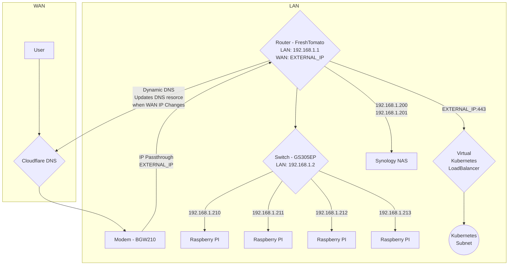
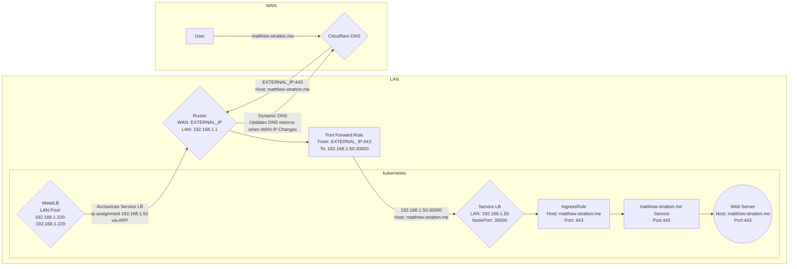
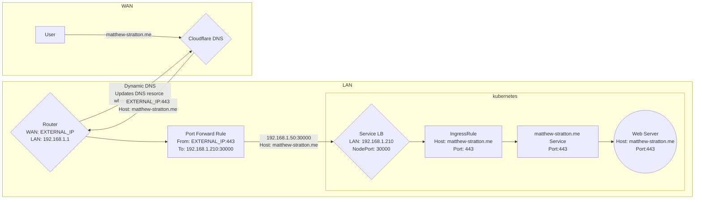

# Outline


1. High level network design
  * physical network diagram
  * DNS
  * Firewall
  * Cluster Load Balancing
2. Router configuration
  * static ips
  * ip pools (dont over lap with metallb)
  * dynamic dns
  * Firewall
  * port forwarding
3. MetalLB and Ingress Controller
  * what each is responsible for, do you need metallb, etc
  * configuring MetalLB
  * configuring ingress-nginx
4. Demo with whoami
  * create CNAME in cloudflare
  * deploy whoami
  * create ingress rule


Resources:
* https://cert-manager.io/v0.13-docs/tutorials/acme/ingress/#step-7---deploy-a-tls-ingress-resource
* https://kubernetes.github.io/ingress-nginx/deploy/baremetal/
* https://docs.openshift.com/container-platform/4.9/networking/metallb/about-metallb.html#nw-metallb-layer2_about-metallb-and-metallb-operator

# FreshTomato

**Note**: use the AIO FreshTomato firmware. The difference between AIO and VPN is really poorly documented. If you install VPN youll be missing a bunch of kernel modules like nfs

Configuring your router steps:
1. Change web admin to use port 8080 (No TLS) or 8443 (TLS), we will need ports 80/443 to route web traffic to our kubernetes cluster
2. Enable SSH access, for increased security disable password login and add you SSH public key to "Authorized Keys"
3. Change the admin username and password from the default if you havent already
4. Set up static ip addresses for your kubernetes network devices (you can also set a hostname here and you will be able to resolve them via that hostname rather than having to remember the static ip address):
  * Synology NAS
  * Network Switch
  * Raspberry Pis
  * metallb will assign LAN ips (192. addresses) for kubernetes services that will appear on the device list here. We can then forward traffic to these lan IP addresses (e.g. router -> nginx-external-lb -> pods hosting a service)
5. firewall script (allow and forward external address from cloudflare ups, allow internal traffic to reach kubernetes)


Firewall script
saved to /mnt/1.44.1-42218/firewall_rules.sh
```
KUBE_LB=192.168.1.220

echo "Configuring firewall rules"

# create cloudflare-proxy chains
iptables -N cloudflare-proxy 2>/dev/null
iptables -N cloudflare-proxy -t nat 2>/dev/null

# add rules to WANPREROUTING/wanin to jump to the cloudflare-proxy chains
if ! iptables -t nat --check WANPREROUTING -j cloudflare-proxy 2>/dev/null; then
  iptables -t nat -A WANPREROUTING -j cloudflare-proxy
fi

if ! iptables --check wanin -j cloudflare-proxy 2>/dev/null; then
  iptables -A wanin -j cloudflare-proxy
fi

# clear old rules
iptables --flush cloudflare-proxy
iptables -t nat --flush cloudflare-proxy

# get cloudflare proxy ip addresses and allow them through the firewall
for i in `curl -s -H 'Cache-Control: no-cache, no-store' https://www.cloudflare.com/ips-v4`; do
  iptables -t nat -A cloudflare-proxy -s $i -p tcp -m tcp --dport 443 -j DNAT --to-destination $KUBE_LB:443
  iptables -A cloudflare-proxy -s $i -d $KUBE_LB -p tcp -m tcp --dport 443 -j ACCEPT
done

# Accept internal ip traffic
if ! iptables --check INPUT -s 192.168.10.0/24 -j ACCEPT 2>/dev/null; then
  iptables -I INPUT -s 192.168.10.0/24 -j ACCEPT
fi

if ! iptables --check INPUT -s 192.168.1.0/24 -j ACCEPT 2>/dev/null; then                              
  iptables -I INPUT -s 192.168.1.0/24 -j ACCEPT                                                        
fi
```

Administration -> Scripts -> Firewall:
```
sh /mnt/1.44.1-42218/firewall_rules.sh
```

### MetalLB

**Resources**:
1. https://particule.io/en/blog/k8s-no-cloud/
2. https://www.debontonline.com/2020/09/loadbalancing-on-raberry-pi-kubernetes.html
3. https://docs.openshift.com/container-platform/4.9/networking/metallb/about-metallb.html#nw-metallb-layer2_about-metallb-and-metallb-operator
```
$ kubectl apply -f ./kube/network/metallb.yml
namespace/metallb-system created
Warning: policy/v1beta1 PodSecurityPolicy is deprecated in v1.21+, unavailable in v1.25+
podsecuritypolicy.policy/controller created
podsecuritypolicy.policy/speaker created
serviceaccount/controller created
serviceaccount/speaker created
clusterrole.rbac.authorization.k8s.io/metallb-system:controller created
clusterrole.rbac.authorization.k8s.io/metallb-system:speaker created
role.rbac.authorization.k8s.io/config-watcher created
role.rbac.authorization.k8s.io/pod-lister created
role.rbac.authorization.k8s.io/controller created
clusterrolebinding.rbac.authorization.k8s.io/metallb-system:controller created
clusterrolebinding.rbac.authorization.k8s.io/metallb-system:speaker created
rolebinding.rbac.authorization.k8s.io/config-watcher created
rolebinding.rbac.authorization.k8s.io/pod-lister created
rolebinding.rbac.authorization.k8s.io/controller created
daemonset.apps/speaker created
deployment.apps/controller created
$ kubectl apply -f ./kube/network/metallb-config.yml
configmap/config created
```

# Diagrams

Network Diagram



MetalLB traffic routing



Host network IngressController
