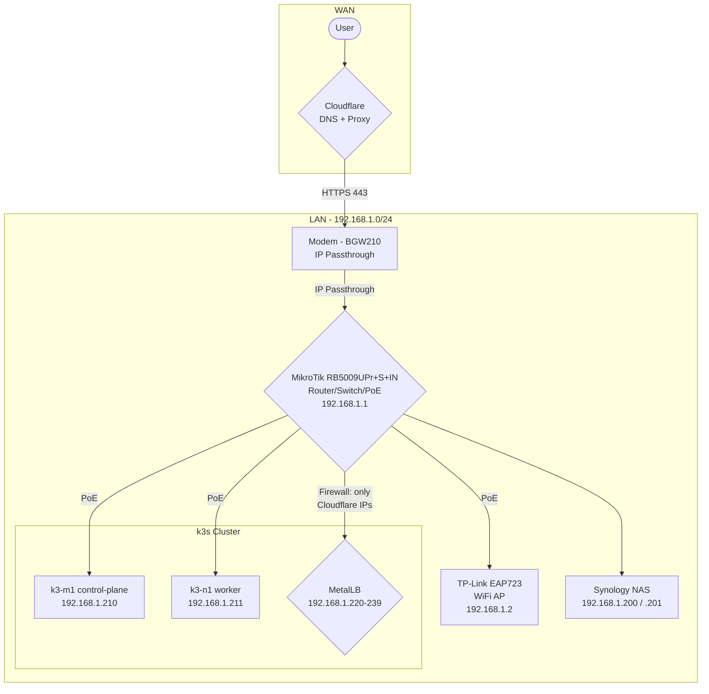

# Networking

This document covers network topology, DNS architecture, load balancing, ingress routing, TLS, and authentication for the homelab. For the hardware overview, see [Getting Started](00-getting-started.md). For k3s server flags that disable built-in networking components, see [RPis and k3s](02-rpis-and-k3s.md#why-k3s).

## Network Topology


```mermaid
graph TD
    subgraph WAN
        User([User])
        CF{Cloudflare<br/>DNS + Proxy}
    end
    subgraph LAN [LAN - 192.168.1.0/24]
        Modem[Modem - BGW210<br/>IP Passthrough]
        Router{MikroTik RB5009UPr+S+IN<br/>Router/Switch/PoE<br/>192.168.1.1}
        AP[TP-Link EAP723<br/>WiFi AP<br/>192.168.1.2]
        Synology[Synology NAS<br/>192.168.1.200 / .201]
        subgraph Cluster [k3s Cluster]
            M1[k3-m1 control-plane<br/>192.168.1.210]
            N1[k3-n1 worker<br/>192.168.1.211]
            MetalLB{MetalLB<br/>192.168.1.220-239}
        end
    end
    User --> CF
    CF -->|HTTPS 443| Modem
    Modem -->|IP Passthrough| Router
    Router -->|Firewall: only<br/>Cloudflare IPs| MetalLB
    Router -->|PoE| AP
    Router -->|PoE| M1
    Router -->|PoE| N1
    Router --> Synology
```

All devices have static IPs: infrastructure devices (Pis, Synology, AP) via DHCP reservations on the router; Kubernetes services via MetalLB. The Pis and AP are powered via PoE directly from the router. MetalLB advertises service IPs on the LAN via ARP (L2 mode), making Kubernetes services reachable as first-class LAN devices.

## Traffic Flow

### External Request (Internet -> Service)

```
User -> Cloudflare DNS (resolves to WAN IP)
     -> Cloudflare Proxy (HTTPS termination + re-encryption)
     -> Router (firewall allows Cloudflare IPs only)
     -> DNAT to 192.168.1.220:443 (nginx-external LB)
     -> ingress-nginx matches Host header -> routes to Service -> Pod
```

### Internal Request (LAN -> Service)

```
LAN client -> Router DNS (resolves *.matthew-stratton.me to MetalLB IP via static entries)
           -> 192.168.1.221 (nginx-internal LB)
           -> ingress-nginx matches Host header -> routes to Service -> Pod
```

The router's static DNS entries resolve `*.matthew-stratton.me` domains to the appropriate MetalLB IPs, so LAN clients reach internal services directly without going through Cloudflare or requiring hairpin NAT.

### Remote Access (VPN + SSH)

Remote access uses two mechanisms, both configured in `ansible/tasks/mikrotik-remote-access.yml`:

- **WireGuard VPN**: Full-tunnel VPN on the router (UDP 51820). Clients get IPs on `10.100.0.0/24` and have full LAN access -- the `wg0` interface is a member of the router's LAN interface list, so VPN traffic is treated as LAN traffic. This means VPN clients can reach all internal ingress services, NAS shares, and other LAN resources. Peer definitions are in `ansible/inventory/group_vars/router.yaml`.
- **SSH ProxyJump**: SSH to internal hosts via the router as a jump host. Port knocking (3-step sequence) gates WAN SSH access; LAN SSH is always open. SSH config aliases (`homelab-jump`, `k3-m1-remote`, `synology-remote`) are in `~/.ssh/config`.

A separate Cloudflare DDNS record (`vpn.*`, not proxied) resolves to the WAN IP for VPN and SSH endpoints. See [Security](05-security.md#remote-access) for hardening details.

## DNS

DNS uses two layers: the router handles LAN split-horizon DNS, and k3s's bundled CoreDNS handles cluster DNS (`cluster.local`). Public DNS is managed on Cloudflare.

### Cloudflare (Public DNS)

Cloudflare manages the `matthew-stratton.me` zone. Public A records point to the router's WAN IP. Dynamic DNS is configured to update Cloudflare when the WAN IP changes (see MikroTik configuration for DDNS setup).

Cloudflare also acts as a reverse proxy for internet-facing services -- external HTTPS traffic passes through Cloudflare before reaching the cluster. The router firewall only accepts traffic from Cloudflare's IP ranges.

### CoreDNS (Cluster DNS)

k3s's bundled CoreDNS handles in-cluster DNS (`cluster.local`). It forwards unknown queries to the node's `/etc/resolv.conf`, which points to the router (`192.168.1.1`). This means pods resolving `*.matthew-stratton.me` go through the router's static DNS entries -- same split-horizon behavior as LAN clients.

### Router Static DNS (LAN Split-Horizon)

The router maintains static DNS entries that map `*.matthew-stratton.me` domains to their MetalLB IPs. These entries are managed by `scripts/homelab-sync-dns.sh`, which scans Ingress resources and writes to `ansible/inventory/group_vars/router.yaml`. Apply with `cd ansible && ansible-playbook mikrotik-configure.yml`.

The `router_dns_hosts` list supports manually-added entries above the `# auto-managed below` marker. The sync script preserves these and only replaces entries below the marker. This is used for services that need split-horizon DNS but aren't Ingress resources (e.g., `relay.matthew-stratton.me` for the Syncthing relay).

Internal services have no public DNS records. LAN clients resolve them via the router (which is the DHCP-pushed DNS server). Pods resolve them via CoreDNS -> router forwarding.

#### CNAME-based resolution (Cloudflare HTTPS RR workaround)

Split-horizon DNS entries use CNAME records pointing to `.homelab` targets rather than direct A records. This works around Cloudflare's HTTPS Resource Records (RFC 9460).

**The problem**: Cloudflare automatically serves HTTPS RRs for proxied domains containing `ipv4hint`/`ipv6hint` fields that point to Cloudflare's proxy IPs. Modern browsers (Firefox, Chrome) query for HTTPS RRs and prefer these hints over A/AAAA records. RouterOS cannot create static HTTPS RR entries (it only supports A, AAAA, CNAME, FWD, MX, NS, NXDOMAIN, SRV, TXT), so HTTPS RR queries pass through to upstream DNS and return Cloudflare's hints -- bypassing split-horizon DNS entirely. The browser connects to Cloudflare instead of the local ingress.

**The fix**: Each hostname is a CNAME to a `.homelab` target that only exists on the router:

```
jellyfin.matthew-stratton.me  CNAME → ingress-external.homelab
ingress-external.homelab      A     → 192.168.1.220
ingress-external.homelab      AAAA  → ::1
```

Because CNAME applies to all query types, the HTTPS RR query follows the chain to `ingress-external.homelab` -- a name no upstream DNS server has heard of. The query returns empty, and the browser falls back to the A record.

Three CNAME targets cover all services:

| Target | IP | Used by |
|--------|----|---------|
| `ingress-external.homelab` | 192.168.1.220 | Internet-facing services (jellyfin, seerr) |
| `ingress-internal.homelab` | 192.168.1.221 | LAN-only services (grafana, sonarr, etc.) |
| `syncthing-relay.homelab` | 192.168.1.233 | Syncthing relay |

The CNAME is transparent to users -- browser URLs, TLS certificate validation, and the `router_dns_hosts` data model are all unchanged.

### Local Client DNS (Split DNS)

A NetworkManager dispatcher script ([`scripts/homelab-split-dns.sh`](../scripts/homelab-split-dns.sh)) handles VPN scenarios for Linux workstations with `systemd-resolved`. When a VPN reconnects with a catch-all `~.` routing domain, it can override the default DNS, causing homelab domains to fail. The script probes the router to detect the home network, then configures a `~matthew-stratton.me` routing domain via `resolvectl` to direct matching queries to the router. It works across connection types (wifi, ethernet, thunderbolt dock), is inert off the home network, and survives VPN reconnects. Install to `/etc/NetworkManager/dispatcher.d/` and `chmod 755`.

## Router Configuration (MikroTik)

The MikroTik RB5009UPr+S+IN is provisioned via Ansible with system configuration, DHCP, DNS, and service hardening. Two playbooks handle setup:

- **`mikrotik-bootstrap.yml`** (one-time): Migrates from factory defaults (192.168.88.0/24) to 192.168.1.0/24, creates SSH user with key auth
- **`mikrotik-configure.yml`** (idempotent): Configures system identity, DHCP pool (192.168.1.50-199), DNS (1.1.1.1), static DHCP leases for infrastructure, service hardening, auto-update scheduling, Cloudflare firewall rules, threat intelligence monitoring, DDNS, WireGuard VPN, and SSH port knocking

The router ships with a factory-default firewall (NAT masquerade, input/forward chains). The configure playbook adds Cloudflare-specific rules: a DNAT rule forwarding port 443 traffic from Cloudflare IPs to the external ingress VIP (`192.168.1.220`), and a forward-accept rule placed before the default drop-all rule. It also deploys a threat intelligence script (`ansible/files/threat-intel-firewall.rsc`) that fetches curated IP blocklists (Spamhaus DROP/EDROP, abuse.ch Feodo Tracker) and logs egress connections to listed destinations. Both the Cloudflare IP address list and threat-intel address list are maintained by scheduled scripts on the router.

Node-level firewalls are disabled -- `firewalld` is masked on all nodes via Ansible. k3s manages its own iptables rules.

## MetalLB

[MetalLB](https://metallb.universe.tf/) provides load balancer IPs for Kubernetes services on bare-metal. It runs in L2 (ARP) mode, announcing service IPs on the LAN so the router and other devices can reach them.

Configuration:
- **IP pool**: `192.168.1.220-239` (defined in `kube/sys/metallb/addresspool.yml`)
- **Mode**: L2Advertisement
- **Chart**: Bitnami MetalLB via Helmfile (`kube/sys/metallb/helmfile.yaml`)

Services request a specific IP from the pool using `spec.loadBalancerIP` in their Service definition. The pool must not overlap with the router's DHCP range.

Current allocations include `192.168.1.220` (nginx-external), `192.168.1.221` (nginx-internal), and `192.168.1.233` (syncthing-relay). See individual app `network.yml` files for the full list.

## Ingress Controllers

The cluster runs two separate ingress-nginx controllers to separate internet-facing and LAN-only traffic. Both deploy to the `ingress-nginx` namespace as independent Helm releases.

### External (`nginx-external`)

Handles internet-facing traffic arriving via Cloudflare.

| Setting | Value |
| ------- | ----- |
| IngressClass | `nginx-external` |
| LoadBalancer IP | `192.168.1.220` |
| Proxy protocol | Enabled (required for Cloudflare) |
| ModSecurity + OWASP CRS | Enabled |
| SSL passthrough | Enabled |

Proxy protocol is needed because traffic arrives through Cloudflare's reverse proxy -- without it, all source IPs would appear as Cloudflare's.

#### Backend TLS cipher selection (ARM / ChaCha20)

The RPi 4B's Cortex-A72 CPU lacks hardware AES acceleration (ARMv8 crypto extensions are not exposed by the kernel). Without it, ChaCha20-Poly1305 is roughly 5x faster than AES-256-GCM in software:

| Cipher | Throughput (16KB blocks) |
| ------ | ----------------------- |
| ChaCha20-Poly1305 | ~358 MB/s |
| AES-128-GCM | ~77 MB/s |
| AES-256-GCM | ~65 MB/s |

For ingresses using `backend-protocol: "HTTPS"`, the ingress-to-backend connection negotiates TLS separately from the client-facing connection. By default this negotiates AES-256-GCM, which is the slowest option on this hardware.

To force ChaCha20 on the backend connection, use the `proxy-ssl-*` annotations. These annotations are gated in ingress-nginx's source code behind `proxy-ssl-secret` -- without one, the controller silently ignores `proxy-ssl-ciphers` and `proxy-ssl-protocols`. To unlock them, provide a secret containing a `ca.crt` field:

```yaml
annotations:
  nginx.ingress.kubernetes.io/backend-protocol: "HTTPS"
  nginx.ingress.kubernetes.io/proxy-ssl-secret: "<namespace>/<secret-name>"
  nginx.ingress.kubernetes.io/proxy-ssl-verify: "off"
  nginx.ingress.kubernetes.io/proxy-ssl-protocols: "TLSv1.2"
  nginx.ingress.kubernetes.io/proxy-ssl-ciphers: "ECDHE-RSA-CHACHA20-POLY1305:ECDHE-ECDSA-CHACHA20-POLY1305"
```

The secret must contain `ca.crt`, `tls.crt`, and `tls.key`. Any valid cert works -- the existing ingress TLS cert can be copied with a `ca.crt` added (e.g., the backend server's own certificate). With `proxy-ssl-verify: "off"`, the CA cert is not validated, it just satisfies the code gate.

The `ssl-ciphers` ConfigMap setting is unrelated -- it controls **client-facing** ciphers (`ssl_ciphers` directive), not backend proxy ciphers (`proxy_ssl_ciphers`).

### Internal (`nginx-internal`)

Handles LAN-only traffic. Access control is enforced at the router level -- the internal ingress VIP (`192.168.1.221`) is only reachable from the LAN interface list, which includes `wg0` (WireGuard VPN). VPN clients have the same access as local LAN clients.

| Setting | Value |
| ------- | ----- |
| IngressClass | `nginx-internal` |
| LoadBalancer IP | `192.168.1.221` |
| SSL passthrough | Enabled |

No ModSecurity or WAF rules -- internal traffic is trusted.

Each app's `network.yml` specifies which ingress class it uses. To see current assignments: `kubectl get ingress -A`.

The Syncthing GUI (`syncthing.matthew-stratton.me`) uses `nginx-internal` for LAN-only access to the always-on sync node's web interface.

## TLS

### Kubernetes TLS (cert-manager)

[cert-manager](https://cert-manager.io/) automates TLS certificate issuance for Kubernetes ingresses. It uses LetsEncrypt with Cloudflare DNS-01 challenges -- no HTTP-01 challenge is needed since DNS validation works regardless of whether the service is internet-accessible.

Two ClusterIssuers are configured:
- **`letsencrypt`** -- Production issuer, used by default
- **`letsencrypt-staging`** -- For testing (avoids rate limits)

The default issuer is set in cert-manager's Helm values (`defaultIssuerName: letsencrypt`), so ingresses get TLS certificates automatically without explicit annotations. Ingresses that need staging certs override with `cert-manager.io/cluster-issuer: "letsencrypt-staging"`.

Cloudflare API credentials (`CF_EMAIL`, `CF_API_KEY`) are injected via `envsubst` from `.envrc` into the ClusterIssuer manifests during deployment.

Configuration lives in `kube/sys/cert-manager/`.

### Synology DSM TLS (acme.sh)

The Synology NAS has its own LetsEncrypt certificate for the DSM web UI, managed separately from cert-manager using [acme.sh](https://github.com/acmesh-official/acme.sh) with Cloudflare DNS validation.

A scheduled task in DSM Control Panel periodically runs a renewal script:

- **Script**: `/var/services/homes/certadmin/cert-renew.sh` (contains Cloudflare API tokens)
- **Synology user**: `certadmin` -- a dedicated DSM user the script uses to update the certificate in DSM
- **Scheduled task**: Runs as the `root` system user
- **Cloudflare auth**: The script needs a [Cloudflare API token](https://github.com/acmesh-official/acme.sh/wiki/dnsapi#dns_cf) -- if renewal breaks, this is the most likely cause

Troubleshooting:
- Add `--debug 2` to the acme.sh commands in the renewal script for verbose output
- SSH access requires `sudo su` to interact with the scheduled task or script
- Upgrade acme.sh (as root): `/usr/local/share/acme.sh/acme.sh --force --upgrade --nocron --home /usr/local/share/acme.sh`

Reference: [Synology DSM 7 with LetsEncrypt and DNS Challenge](https://dr-b.io/post/Synology-DSM-7-with-Lets-Encrypt-and-DNS-Challenge)

## References

- [ingress-nginx bare-metal considerations](https://kubernetes.github.io/ingress-nginx/deploy/baremetal/)
- [MetalLB L2 mode](https://metallb.universe.tf/concepts/layer2/)
- [cert-manager ACME ingress tutorial](https://cert-manager.io/docs/tutorials/acme/ingress/)
- [acme.sh Cloudflare DNS API](https://github.com/acmesh-official/acme.sh/wiki/dnsapi#dns_cf)

## Related Documentation

- [Getting Started](00-getting-started.md) -- Hardware details, software stack overview
- [RPis and k3s](02-rpis-and-k3s.md) -- k3s configuration, disabled components (Traefik, ServiceLB)
- [Persistence](03-persistence.md) -- Synology NAS storage configuration
- [Security](05-security.md) -- Authentication and access control
- [Observability](06-observability.md) -- Logging and monitoring
