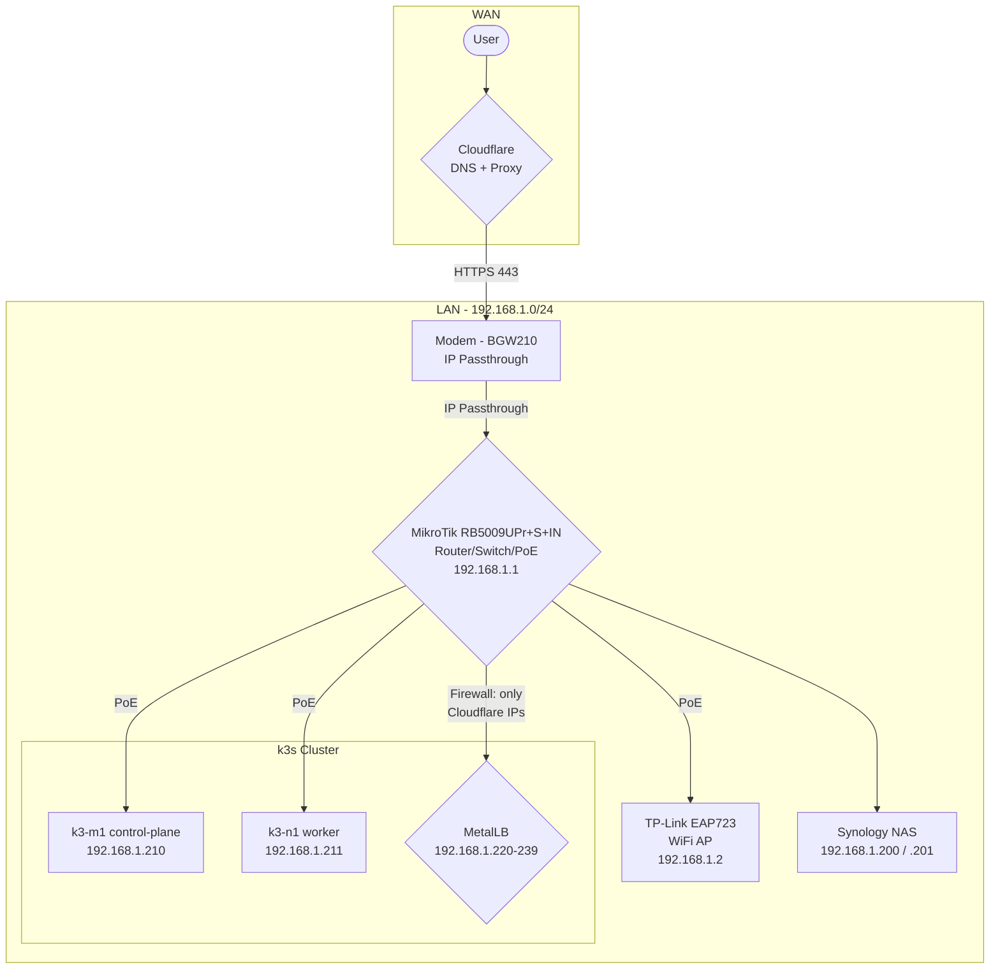

# Networking

This document covers network topology, DNS architecture, load balancing, ingress routing, TLS, and authentication for the homelab. For the hardware overview, see [Getting Started](00-getting-started.md). For k3s server flags that disable built-in networking components, see [RPis and k3s](02-rpis-and-k3s.md#why-k3s).

## Network Topology



All devices have static IPs: infrastructure devices (Pis, Synology, AP) via DHCP reservations on the router; Kubernetes services via MetalLB. The Pis and AP are powered via PoE directly from the router. MetalLB advertises service IPs on the LAN via ARP (L2 mode), making Kubernetes services reachable as first-class LAN devices.

## Traffic Flow

### External Request (Internet -> Service)

```
User -> Cloudflare DNS (resolves to WAN IP)
     -> Cloudflare Proxy (HTTPS termination + re-encryption)
     -> Router (firewall allows Cloudflare IPs only)
     -> DNAT to 192.168.1.220:443 (nginx-external LB)
     -> ingress-nginx matches Host header -> routes to Service -> Pod
```

### Internal Request (LAN -> Service)

```
LAN client -> CoreDNS (resolves *.matthew-stratton.me to MetalLB IP)
           -> 192.168.1.221 (nginx-internal LB)
           -> ingress-nginx matches Host header -> routes to Service -> Pod
```

CoreDNS static hosts resolve `*.matthew-stratton.me` domains to the appropriate MetalLB IPs, so LAN clients reach internal services directly without going through Cloudflare or requiring hairpin NAT.

## DNS

DNS resolution flows through a chain: clients query CoreDNS, which forwards unknown queries to AdGuard Home for ad-blocking, which falls back to Cloudflare (`1.1.1.1`) for upstream resolution. Public DNS is managed on Cloudflare.

### Cloudflare (Public DNS)

Cloudflare manages the `matthew-stratton.me` zone. Public A records point to the router's WAN IP. Dynamic DNS is configured to update Cloudflare when the WAN IP changes (see MikroTik configuration for DDNS setup).

Cloudflare also acts as a reverse proxy for internet-facing services -- external HTTPS traffic passes through Cloudflare before reaching the cluster. The router firewall only accepts traffic from Cloudflare's IP ranges.

### CoreDNS (Cluster + LAN DNS)

k3s's built-in CoreDNS is disabled. A custom CoreDNS deployment provides both in-cluster DNS (`cluster.local`) and LAN-wide DNS resolution.

CoreDNS is exposed to the LAN at `192.168.1.223` via two LoadBalancer services (one UDP, one TCP, sharing the same IP via MetalLB's `allow-shared-ip` annotation). LAN clients (or the router's DHCP settings) can point to this IP for DNS.

The Corefile forwards unknown queries to AdGuard Home (`192.168.1.222`) first, then Cloudflare (`1.1.1.1`) as a fallback. A static hosts file maps infrastructure hostnames and `*.matthew-stratton.me` domains to their MetalLB IPs, so LAN clients resolve internal services without hairpin NAT.

Configuration lives in `kube/sys/coredns/coredns.yml`.

### AdGuard Home (Ad-blocking DNS)

AdGuard Home runs at `192.168.1.222` and sits between CoreDNS and the upstream resolver. It filters ads and trackers for all DNS queries originating from the LAN. Configuration is managed via the AdGuard web UI at `adguard.matthew-stratton.me`.

### Local Client DNS (Split DNS)

Internal services have no public DNS records -- they only exist in CoreDNS's static hosts file. LAN clients using an external resolver (Cloudflare, VPN-pushed DNS, etc.) won't be able to resolve them.

A NetworkManager dispatcher script ([`scripts/homelab-split-dns.sh`](../scripts/homelab-split-dns.sh)) handles this for Linux workstations with `systemd-resolved`. On every connection event, it probes CoreDNS to detect the home network, then configures a `~matthew-stratton.me` routing domain via `resolvectl` to direct matching queries to CoreDNS. It works across connection types (wifi, ethernet, thunderbolt dock), is inert off the home network, and survives VPN reconnects. Install to `/etc/NetworkManager/dispatcher.d/` and `chmod 755`.

## Router Configuration (MikroTik)

The MikroTik RB5009UPr+S+IN is provisioned via Ansible with system configuration, DHCP, DNS, and service hardening. Two playbooks handle setup:

- **`mikrotik-bootstrap.yml`** (one-time): Migrates from factory defaults (192.168.88.0/24) to 192.168.1.0/24, creates SSH user with key auth
- **`mikrotik-configure.yml`** (idempotent): Configures system identity, DHCP pool (192.168.1.50-199), DNS (1.1.1.1), static DHCP leases for infrastructure, service hardening, auto-update scheduling, Cloudflare firewall rules, and DDNS

The router ships with a factory-default firewall (NAT masquerade, input/forward chains). The configure playbook adds Cloudflare-specific rules: a DNAT rule forwarding port 443 traffic from Cloudflare IPs to the external ingress VIP (`192.168.1.220`), and a forward-accept rule placed before the default drop-all rule. The Cloudflare IP address list and DDNS record are maintained by scheduled scripts on the router.

Node-level firewalls are disabled -- `firewalld` is masked on all nodes via Ansible. k3s manages its own iptables rules.

## MetalLB

[MetalLB](https://metallb.universe.tf/) provides load balancer IPs for Kubernetes services on bare-metal. It runs in L2 (ARP) mode, announcing service IPs on the LAN so the router and other devices can reach them.

Configuration:
- **IP pool**: `192.168.1.220-239` (defined in `kube/sys/metallb/addresspool.yml`)
- **Mode**: L2Advertisement
- **Chart**: Bitnami MetalLB via Helmfile (`kube/sys/metallb/helmfile.yaml`)

Services request a specific IP from the pool using `spec.loadBalancerIP` in their Service definition. The pool must not overlap with the router's DHCP range.

## Ingress Controllers

The cluster runs two separate ingress-nginx controllers to separate internet-facing and LAN-only traffic. Both deploy to the `ingress-nginx` namespace as independent Helm releases.

### External (`nginx-external`)

Handles internet-facing traffic arriving via Cloudflare.

| Setting | Value |
| ------- | ----- |
| IngressClass | `nginx-external` |
| LoadBalancer IP | `192.168.1.220` |
| Proxy protocol | Enabled (required for Cloudflare) |
| ModSecurity + OWASP CRS | Enabled |
| SSL passthrough | Enabled |

Proxy protocol is needed because traffic arrives through Cloudflare's reverse proxy -- without it, all source IPs would appear as Cloudflare's.

### Internal (`nginx-internal`)

Handles LAN-only traffic. Restricted by source IP ranges.

| Setting | Value |
| ------- | ----- |
| IngressClass | `nginx-internal` |
| LoadBalancer IP | `192.168.1.221` |
| Source IP allowlist | `192.168.1.0/24`, `10.42.0.0/24`, `10.43.0.0/16` |
| External traffic policy | `Local` (preserves client IP) |
| SSL passthrough | Enabled |

No ModSecurity or WAF rules -- internal traffic is trusted.

Each app's `network.yml` specifies which ingress class it uses. To see current assignments: `kubectl get ingress -A`.

## TLS

### Kubernetes TLS (cert-manager)

[cert-manager](https://cert-manager.io/) automates TLS certificate issuance for Kubernetes ingresses. It uses LetsEncrypt with Cloudflare DNS-01 challenges -- no HTTP-01 challenge is needed since DNS validation works regardless of whether the service is internet-accessible.

Two ClusterIssuers are configured:
- **`letsencrypt`** -- Production issuer, used by default
- **`letsencrypt-staging`** -- For testing (avoids rate limits)

The default issuer is set in cert-manager's Helm values (`defaultIssuerName: letsencrypt`), so ingresses get TLS certificates automatically without explicit annotations. Ingresses that need staging certs override with `cert-manager.io/cluster-issuer: "letsencrypt-staging"`.

Cloudflare API credentials (`CF_EMAIL`, `CF_API_KEY`) are injected via `envsubst` from `.envrc` into the ClusterIssuer manifests during deployment.

Configuration lives in `kube/sys/cert-manager/`.

### Synology DSM TLS (acme.sh)

The Synology NAS has its own LetsEncrypt certificate for the DSM web UI, managed separately from cert-manager using [acme.sh](https://github.com/acmesh-official/acme.sh) with Cloudflare DNS validation.

A scheduled task in DSM Control Panel periodically runs a renewal script:

- **Script**: `/var/services/homes/certadmin/cert-renew.sh` (contains Cloudflare API tokens)
- **Synology user**: `certadmin` -- a dedicated DSM user the script uses to update the certificate in DSM
- **Scheduled task**: Runs as the `root` system user
- **Cloudflare auth**: The script needs a [Cloudflare API token](https://github.com/acmesh-official/acme.sh/wiki/dnsapi#dns_cf) -- if renewal breaks, this is the most likely cause

Troubleshooting:
- Add `--debug 2` to the acme.sh commands in the renewal script for verbose output
- SSH access requires `sudo su` to interact with the scheduled task or script
- Upgrade acme.sh (as root): `/usr/local/share/acme.sh/acme.sh --force --upgrade --nocron --home /usr/local/share/acme.sh`

Reference: [Synology DSM 7 with LetsEncrypt and DNS Challenge](https://dr-b.io/post/Synology-DSM-7-with-Lets-Encrypt-and-DNS-Challenge)

## References

- [ingress-nginx bare-metal considerations](https://kubernetes.github.io/ingress-nginx/deploy/baremetal/)
- [MetalLB L2 mode](https://metallb.universe.tf/concepts/layer2/)
- [cert-manager ACME ingress tutorial](https://cert-manager.io/docs/tutorials/acme/ingress/)
- [acme.sh Cloudflare DNS API](https://github.com/acmesh-official/acme.sh/wiki/dnsapi#dns_cf)

## Related Documentation

- [Getting Started](00-getting-started.md) -- Hardware details, software stack overview
- [RPis and k3s](02-rpis-and-k3s.md) -- k3s configuration, disabled components (Traefik, ServiceLB, CoreDNS)
- [Persistence](03-persistence.md) -- Synology NAS storage configuration
- [Security](05-security.md) -- Authentication with oauth2-proxy
- [Observability](06-observability.md) -- Logging and monitoring
