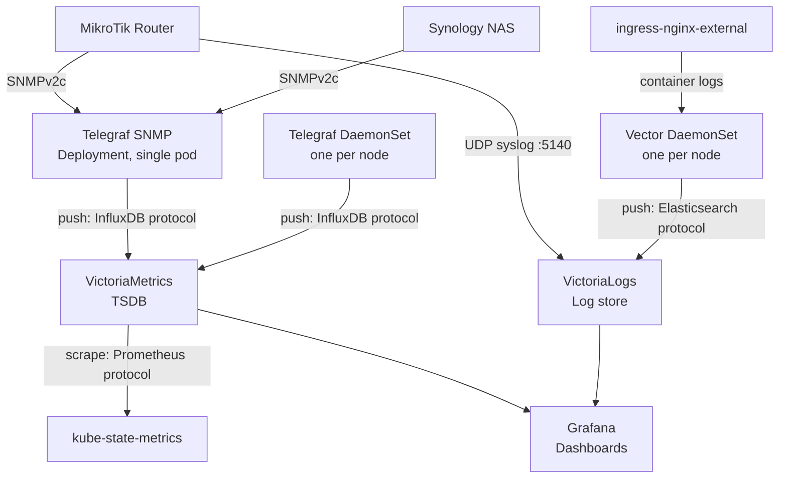

# Observability

The homelab runs a VictoriaMetrics + Telegraf + Grafana stack for metrics and a VictoriaLogs + Vector stack for targeted log collection. All components run in the `obs` namespace. Configuration lives in `kube/observation/`.

## Architecture



VictoriaMetrics receives metrics from three sources:

- **Telegraf DaemonSet** -- Runs on every node (including control-plane). Collects system metrics (e.g. CPU, memory, disk) and container metrics from the kubelet API. Pushes to VictoriaMetrics via InfluxDB line protocol.
- **Telegraf SNMP** -- A single pod that polls the MikroTik router and Synology NAS via SNMPv2c for device-level metrics (e.g. temperatures, disk health, interface traffic). Pushes to VictoriaMetrics via InfluxDB line protocol. The `.gotmpl` template injects the SNMP community string from the `SNMP_COMMUNITY` env var.
- **kube-state-metrics** -- Exposes Kubernetes object state (e.g. pod phases, resource requests/limits) as Prometheus metrics. VictoriaMetrics scrapes these on a regular interval.

**VictoriaMetrics** is a single-node time-series database. It receives pushed metrics from Telegraf (InfluxDB protocol) and scrapes kube-state-metrics (Prometheus protocol).

**Grafana** queries VictoriaMetrics as a Prometheus-type datasource and VictoriaLogs via the `victoriametrics-logs-datasource` plugin. Dashboard JSON files live in `kube/observation/grafana/dashboards/`:

- **Homelab Overview** -- Infrastructure health across router, NAS, and cluster nodes (e.g. CPU, memory, temperatures, network traffic).
- **Kubernetes** -- Workload state (e.g. pod phases, container restarts, resource usage vs limits). Filterable by namespace.

## Metrics Filtering

Metrics are filtered at the collection layer to reduce agent memory, ingestion volume, and VictoriaMetrics storage.

**Telegraf inputs** use `fieldinclude` (whitelist) to control which fields are collected per plugin. This filters at collection time, before metrics enter the agent's buffer. Each input in `helm-values.yml` specifies only the fields it needs.

**kube-state-metrics** uses a `collectors` list in `helm-values.yml` to restrict which Kubernetes resource types are scraped. Only resource types referenced by dashboards or needed for operational alerts are enabled.

**Selection criteria** (apply when adding new metrics or reviewing existing ones):

1. **Dashboard usage** -- Is a Grafana dashboard querying it? Retain.
2. **Diagnostic value** -- Would this metric help diagnose a real scenario (OOM, IO stalls, network saturation, SD card wear)? Retain.
3. **Cardinality** -- Per-node metrics are cheap; per-pod/per-container metrics multiply with workload count. Prefer lower cardinality sources.
4. **Redundancy** -- If another input already provides equivalent data (e.g., the `net` input covers network errors, so `kubernetes` pod network errors are redundant), drop the duplicate.

The `kubernetes` input is the highest cardinality source because it creates series per pod and container. Only fields unavailable from system-level inputs (per-container CPU/memory, per-pod network) are retained there.

When adding new dashboards or metrics, re-evaluate against these criteria. Prefer adding a field to an existing input over enabling a new collector.

## SNMP Prerequisites

Enable SNMPv2c on both targets before deploying Telegraf SNMP:

- **MikroTik:** Enabled via Ansible (`ansible-playbook mikrotik-configure.yml`). Verify: `ssh router '/snmp print'` shows `enabled: yes`.
- **Synology:** Enabled manually via DSM Control Panel > Terminal & SNMP. Verify: `snmpwalk -v2c -c $SNMP_COMMUNITY 192.168.1.200 sysDescr`.

Both use the same community string from the `SNMP_COMMUNITY` env var in `.envrc`.

## Log Ingestion

**VictoriaLogs** is a single-node log database from the same ecosystem as VictoriaMetrics. It collects targeted logs (not all container output) for security monitoring and debugging. Configuration lives in `kube/observation/victorialogs/`.

- **Vector DaemonSet** -- Bundled as a dependency of the VictoriaLogs Helm chart. Collects Kubernetes container logs using Vector's `kubernetes_logs` source and pushes to VictoriaLogs via the Elasticsearch bulk API. Which pods are collected and how logs are tagged is configured in the `vector:` section of `helm-values.yml`.
- **MikroTik syslog** -- The router forwards log topics via UDP syslog directly to VictoriaLogs' built-in syslog receiver (exposed via a MetalLB LoadBalancer). Configured in `ansible/mikrotik-configure.yml`.

Logs can be queried via Grafana (Explore > VictoriaLogs datasource) or the [LogsQL](https://docs.victoriametrics.com/victorialogs/logsql/) HTTP API. To see what's currently collected, query the active streams:

```bash
curl -s 'http://victorialogs.obs.svc:9428/select/logsql/streams?query=*'
```

## Ad-hoc Queries

VictoriaMetrics exposes a Prometheus-compatible query API at `https://victoriametrics.matthew-stratton.me` (internal ingress). Useful for debugging metrics collection or exploring available data without Grafana.

```bash
# Instant query -- current value
curl -sg 'https://victoriametrics.matthew-stratton.me/api/v1/query?query=mem_used_percent'

# Range query -- last hour, 5-minute steps
curl -sg 'https://victoriametrics.matthew-stratton.me/api/v1/query_range?query=cpu_usage_idle&start=-1h&step=5m'

# List all metric names
curl -sg 'https://victoriametrics.matthew-stratton.me/api/v1/label/__name__/values'

# Find labels for a metric
curl -sg 'https://victoriametrics.matthew-stratton.me/api/v1/labels?match[]=kube_pod_status_phase'
```

The in-cluster URL is `http://victoriametrics-server.obs.svc:8428` for queries from within pods.

## Previous Experiments

Elasticsearch+Kibana and Fluent-bit+Loki+Grafana were tested as centralized logging solutions but required too many resources for the Raspberry Pi nodes. Old configs are archived in `kube/graveyard/`.

## Related Documentation

- [Getting Started](00-getting-started.md) -- Hardware specs and resource constraints
- [Persistence](03-persistence.md) -- NFS storage classes used by VictoriaMetrics and Grafana
- [Networking](04-networking.md) -- Internal ingress and DNS configuration
- [Infrastructure Provisioning](01-infrastructure-provisioning.md) -- Ansible playbooks including MikroTik SNMP setup
